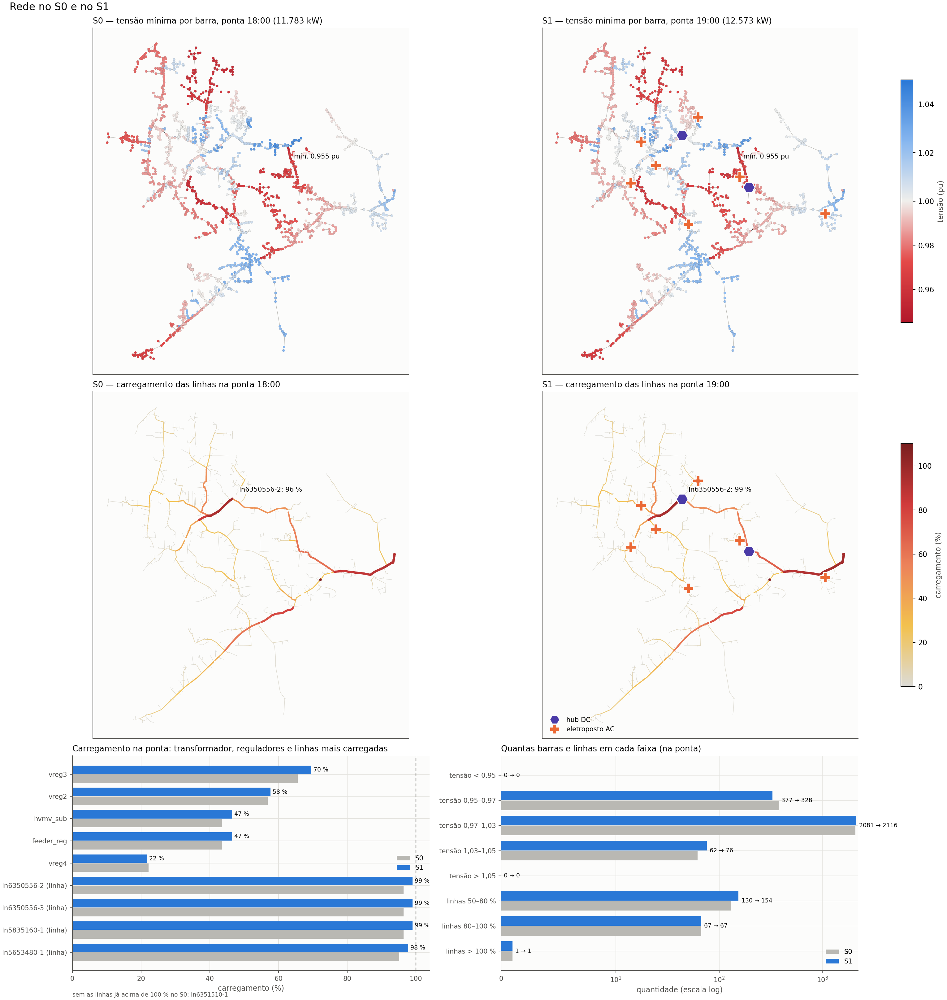
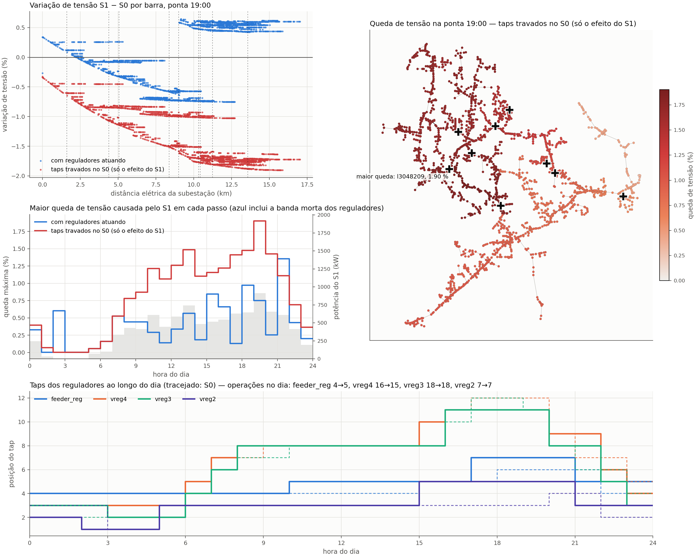

# S2 (BESS) e S3 (V2G): o que cada um desenvolve

Para: **Kenia** (BESS, S2) e **Cesar** (V2G, S3) · De: Ayrton (EVCS, S1) · Branch: `feature/ieee8500`

O S4 (EVCS + BESS + V2G) só será trabalhado **depois que S2 e S3 estiverem completos** (critérios no fim deste documento).

## 1. Onde estamos

Todos os cenários rodam no **IEEE 8500** (redução de média tensão, ~11 × 12 km, 10,8 MW na ponta), escolhido em `configs/network.yaml`. Dois valores foram ajustados em relação aos dados IEEE (ampacidade por condutor; fonte em 1,0 pu e reguladores em 1,03 pu); detalhes em [`data/ieee8500/README.md`](../data/ieee8500/README.md).

- **S0** — caso base, sem estações.
- **S1** — 5000 carros elétricos recarregando em **2 hubs DC + 7 eletropostos AC** (modelo de sessões do EVCS, sites escolhidos pela triagem), mais a estação anfitriã do V2G na barra `m1125976`.

Integração S0–S4, passo de 1 h (`results/ieee8500/integration/`):

| | S0 | S1 | Diferença |
|---|---|---|---|
| Ponta na subestação | 11.783 kW às 18h | 12.573 kW às 19h | **+790 kW** e a ponta muda de hora |
| Demanda das estações na ponta | — | 913 kW às 19h | 9,6 MWh/dia atendidos |
| Perdas no dia | 14,4 MWh | 15,7 MWh | **+9 %** |
| Tronco sul 2/0 ACSR (`ln5835160-1`) | 96 % | **100,5 %** | sobrecarga às 18h (99 % às 19h) |
| Tronco da saída 397 ACSR (`ln5513564-1`) | 92 % | 97 % | |
| Tensão mínima, reguladores atuando | 0,951 pu | 0,954 pu | reguladores compensam |
| Tensão mínima, taps travados no S0 | 0,951 pu | **0,938 pu** | efeito real das estações: até −1,9 % |





No estudo intradiário do EVCS (passo de 15 min, `results/ieee8500/s1/`) o quadro é o mesmo, com picos mais altos: com 4000–5000 carros a linha mais carregada chega a 100 % entre 18h e 20h, e sem a ação dos reguladores a tensão mínima cairia para 0,943 pu.


**Os problemas para S2 e S3 resolverem:** a ponta das 18h–20h, a sobrecarga do tronco sul e a queda de tensão no fim dos ramais (até 2 %), sem piorar as perdas nem gastar o tap dos reguladores.

**Hoje S2 e S3 não mudam nada** (S2 = S1 e S3 = S1 nos números acima): a BESS tem 40 kW / 120 kWh e o V2G tem 3 carros, valores pensados para o IEEE123 (3,5 MW). É o ponto de partida do trabalho de vocês.

## 2. O que já está pronto para vocês

| | Kenia — BESS | Cesar — V2G |
|---|---|---|
| Código | `src/bess/` (`strategies.py`: `peak_shave`, `template`) | `src/v2g/` (`strategies.py`: `heuristic`, `template`) |
| Parâmetros | `configs/bess.yaml` | `configs/v2g.yaml` |
| Contrato com a integração (não mudar sem combinar) | `bess.runner.run_integrated(config_dir, grid, demand_kw)` | `v2g.runner.run_integrated(config_dir, grid, evcs_profile, enable_v2g)` |
| O que recebem | `demand_kw`: demanda total do alimentador antes da BESS (cargas + EV + V2G), kW por hora | perfil do EVCS; a demanda da estação anfitriã vem em `evcs_profile.metadata["station_demand_kw"]` |
| Conexão atual | barra `m1125976` (`connection.bus`) | estação anfitriã `m1125976`, 8 × 11 kW bidirecionais, 88 kW (definida em `configs/evcs.yaml` → `station`) |
| Teste do módulo | `python -m pytest tests/test_bess.py tests/test_strategies.py -q` | `python -m pytest tests/test_v2g.py tests/test_strategies.py -q` |

Para rodar e comparar (na raiz, `PYTHONPATH=src`):

```powershell
python -m bess        # ou: python -m v2g  — execução independente, sem rede (rápida)
python -m integration.coordinator --output results/ieee8500/integration --frozen-taps   # S0–S4 na rede, ~15 min
```

Saídas de comparação em `results/ieee8500/integration/`: `summary.csv` (ponta, perdas, tensões, carregamento e KPIs por cenário), `impact.csv`, `impact_S2.png` / `impact_S3.png` (cada cenário contra o S0, com e sem a ação dos reguladores) e `network_state_S2.png` / `network_state_S3.png` (a rede lado a lado com o S0). O efeito de vocês é a diferença **S2 − S1** e **S3 − S1** nessas tabelas. A tabela da integração (S0–S4 lado a lado) também aparece em `results/ieee8500/resumo/LEIA-ME.md`, atualizado sozinho ao fim de cada integração; as tabelas completas por cenário ficam em `integration/dados/`.

## 3. Kenia — S2: BESS

**Objetivo:** reduzir a ponta das 18h–20h criada pelo S1 e tirar o tronco sul da sobrecarga, com a bateria terminando o dia no SOC inicial.

1. **Dimensionar potência e energia.** O pico das estações é ~900 kW (1 h) e dura de 17h a 21h; ordem de grandeza: **0,5–1 MW e 2–4 MWh**. Definir o critério (cortar a ponta da subestação, aliviar o tronco, custo × benefício).
2. **Escolher onde ligar.** Atenção: a barra atual, `m1125976`, fica **antes** do tronco sul; uma BESS ali alivia a ponta da subestação e o tronco da saída, mas **não** a linha `ln5835160-1`. Para aliviar o tronco sul, a BESS precisa ficar depois dele: a barra trifásica mais próxima é **`m1069504`** (8,7 km), que tem outras 1.209 barras a jusante. Cuidado com a recarga da BESS: ela também passa pelo tronco e deve ocorrer fora da ponta.
3. **Estratégia de despacho.** `peak_shave` com `target_kw` fixo é o ponto de partida. Ideias: alvo pela curva prevista, despacho por tarifa horária, limite de ciclos/degradação. Implementar em `template` (ou uma nova função registrada em `STRATEGIES`).
4. **KPIs:** redução da ponta, carregamento do tronco, perdas, ciclos equivalentes, degradação (USD) e CAPEX.

**Limitação a discutir:** a integração passa só a demanda **total** do alimentador e aceita **uma** conexão. Despachar pelo fluxo de uma linha específica ou usar duas BESS exige mudar o contrato (`run_integrated`), o que precisa ser combinado entre os três.

## 4. Cesar — S3: V2G

**Objetivo:** usar os carros conectados para devolver energia na ponta (janela de descarga hoje: 17h–21h), sem comprometer a próxima viagem.

1. **Tamanho da frota.** 3 carros × 11 kW não aparecem num alimentador de 10,8 MW. Para efeito visível: **50–100 carros** (0,5–1,1 MW). Definir chegada/saída, energia de viagem e SOC mínimo de forma realista.
2. **Estação anfitriã.** Os carros dividem a estação `m1125976` (8 portas, 88 kW). Uma frota maior precisa de uma estação maior: **combinar comigo** (o bloco `station` fica em `configs/evcs.yaml`) o número de carregadores, a potência de conexão e, se for o caso, outra barra. A mesma observação da BESS vale aqui: `m1125976` fica antes do tronco sul.
3. **Estratégia.** `heuristic` é o ponto de partida; implementar a sua em `template`: agenda por veículo respeitando reserva de mobilidade, SOC e portas (a função `fleet_profile` já valida tudo isso).
4. **KPIs:** energia devolvida, redução da ponta, energia de mobilidade garantida na saída, degradação.

## 5. Quando S2 e S3 estão "100 %"

Vale para os dois (cada um no seu cenário):

- [ ] O contrato `run_integrated` não mudou, ou a mudança foi combinada e aprovada pelos três.
- [ ] `python -m pytest -q` passa (inclui `test_module_independence.py` e `test_strategies.py`).
- [ ] Parâmetros com origem explicada no YAML (o que é dado e o que é hipótese).
- [ ] Integração rodada com `--frozen-taps`; `impact_S2.png` / `impact_S3.png` e `summary.csv` mostram, em relação ao S1: **ponta da subestação menor**, **tronco sul ≤ 100 %**, **tensão mínima ≥ 0,95 pu** e perdas iguais ou menores.
- [ ] SOC final = SOC inicial (BESS) e energia de saída garantida para todos os carros (V2G).
- [ ] README curto do módulo (`src/bess/README.md`, `src/v2g/README.md`) no mesmo formato de `src/evcs/README.md`: hipóteses, como rodar, resultados.

Com os dois completos, montamos o S4 juntos.

## 6. Decisões em aberto

| Decisão | Quem |
|---|---|
| Barra(s) da BESS e se precisamos de mais de uma conexão | Kenia + todos (contrato) |
| Tamanho da estação anfitriã do V2G e sua barra | Cesar + Ayrton |
| Passo da integração: 1 h hoje; 15 min mostraria picos maiores (o EVCS já calcula a 15 min) | todos |
| Frota de EV do S1 (5000 carros, caso de estresse) | Ayrton, combinado com os dois |
