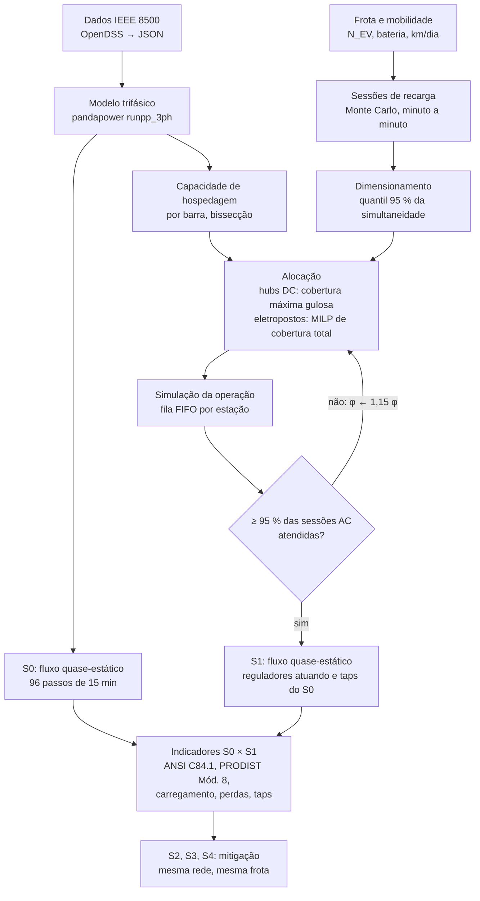

# Metodologia

Impacto de estações de recarga de veículos elétricos (EVCS) num alimentador de distribuição e mitigação por armazenamento (BESS) e *vehicle-to-grid* (V2G). Alimentador de teste: IEEE 8500 nós.

Este documento descreve o método do trabalho no nível de detalhe de um artigo: formulação, variáveis com unidades, restrições, solvers e protocolo experimental. Cada etapa está marcada com o seu estado:

- ✅ **implementado e executado**: a etapa existe no repositório e os números citados vêm dela;
- 🔶 **proposto**: formulação sugerida para S2, S3 e S4, ainda não implementada.

Os números do S1 são da execução de 10/10/2026 (`results/ieee8500/`).

---

## 1. Problema e hipótese

**Pergunta.** Quanto uma frota urbana de carros elétricos, recarregando em estações públicas distribuídas para atender toda a área do alimentador, degrada a operação da rede de média tensão? Em que medida uma BESS e o V2G recuperam essa operação?

**Hipótese de trabalho.**
- O cenário S1 eleva a demanda de ponta e leva a rede a violar limites térmicos e de tensão.
- Os cenários S2 a S4 reduzem essas violações sem comprometer a energia entregue aos veículos.

| Cenário | Conteúdo | Papel no estudo | Estado |
|---|---|---|---|
| S0 | Alimentador com as cargas existentes e a curva diária | Caso base (referência de todas as comparações) | ✅ |
| S1 | S0 + estações de recarga (hubs DC e eletropostos AC), frota de $N_{EV}$ carros | Problematiza a rede | ✅ |
| S2 | S1 + BESS | Mitiga a sobrecarga do S1 | 🔶 heurística de corte de ponta existe; formulação na §11.1 |
| S3 | S1 + V2G | Mitiga com a própria frota | 🔶 heurística existe; formulação na §11.2 |
| S4 | S1 + BESS + V2G | Operação coordenada | 🔶 §11.3, depois de S2 e S3 |

O efeito de cada tecnologia é medido como diferença entre cenários: S1 − S0 é o impacto da recarga; S2 − S1, S3 − S1 e S4 − S1 são os efeitos da mitigação.

## 2. Fluxo metodológico



Etapas do fluxo:

| Etapa | Comando | Módulo |
|---|---|---|
| S0 | `python -m integration.s0_study` | [s0_study.py](../src/integration/s0_study.py) |
| Triagem e alocação | `python -m integration.evcs_screening` | [evcs_screening.py](../src/integration/evcs_screening.py), [planning.py](../src/evcs/planning.py), [hosting.py](../src/network/hosting.py) |
| S1 | `python -m integration.s1_study` | [s1_study.py](../src/integration/s1_study.py) |
| Análise S0 × S1 | `python -m integration.analysis` | [analysis.py](../src/integration/analysis.py) |
| Integração S0–S4 | `python -m integration.coordinator` | [coordinator.py](../src/integration/coordinator.py) |

## 3. Sistema de teste ✅

O sistema de teste é o **IEEE 8500 nós** (Arritt e Dugan, 2010), caso de carga equilibrada. Os arquivos OpenDSS públicos foram convertidos em JSON por [build_ieee8500_data.py](../scripts/build_ieee8500_data.py), com SHA-256 de cada fonte registrado.

| Grandeza | Valor |
|---|---|
| Barras de média tensão (12,47 kV) + fonte (115 kV) | 2.520 + 1 |
| Barras trifásicas de média tensão | 647 |
| Linhas de média tensão | 2.483 (170 km) |
| Consumidores (cargas) | 1.177, em 1.138 barras; 10.773 kW / 2.700 kvar nominais (FP 0,97) |
| Subestação | 115/12,47 kV, 27,5 MVA, $x$ = 15,51 % |
| Reguladores | 4 bancos (subestação + 3 na rede), ±16 taps de 0,625 % |
| Capacitores | 4 bancos, 3.900 kvar |
| Extensão | ~11 × 12 km; maior distância elétrica à subestação: 17 km |

**Redução de média tensão.** Cada transformador de serviço monofásico, com o seu ramal triplex e a carga de 120/240 V, é substituído por uma carga PQ na barra e na fase primária do transformador. As perdas e as impedâncias da baixa tensão são desprezadas.

**Ajustes declarados em relação aos dados IEEE.** Ambos estão registrados em `provenance.adjustments` do JSON e em [data/ieee8500/README.md](../data/ieee8500/README.md).

1. **Ampacidade por condutor**, no lugar dos 400 A padrão do OpenDSS: 397 ACSR 587 A; 4/0 357 A; 2/0 276 A; 1/0 242 A; #2 184 A; #4 140 A; #6 105 A. Os valores são de catálogo (75 °C de condutor, 25 °C de ambiente, vento de 0,6 m/s).
2. **Nível de tensão:** fonte em 1,00 pu e todos os reguladores com $V^{reg}$ = 1,03 pu. A referência começa acima de 1,05 pu perto da subestação.

Com os ajustes, o S0 fica entre 0,951 e 1,048 pu e não tem sobrecargas novas.

## 4. Modelo da rede elétrica ✅

### 4.1 Fluxo de potência trifásico

O modelo usa o fluxo desequilibrado `runpp_3ph` do pandapower 3.4 (Thurner et al., 2018), em componentes de sequência. A matriz de impedância de fase de cada linha é aproximada pelas impedâncias de sequência:

$$
Z_1 = \overline{Z_{ii}} - \overline{Z_{ij}}, \qquad Z_0 = \overline{Z_{ii}} + 2\,\overline{Z_{ij}}
$$

em que $\overline{Z_{ii}}$ e $\overline{Z_{ij}}$ são as médias dos termos próprios e mútuos (Ω/km). O acoplamento mútuo desigual entre fases é perdido; o desequilíbrio de carga entre fases é preservado.

### 4.2 Cargas dependentes da tensão (ZIP)

A potência de cada carga $b$, fase $\phi$, passo $t$ é:

$$
S_{b\phi t} = S^{nom}_{b\phi}\,\mu_t \left(\frac{|V_{b\phi t}|}{V^{nom}_b}\right)^{\alpha_b},
\qquad \alpha_b \in \{0, 1, 2\}
$$

- $\alpha_b$ = 0 para potência constante, 1 para corrente constante e 2 para impedância constante (modelos 1, 5 e 2 do OpenDSS).
- Nas cargas em delta, $V$ é a tensão fase-fase.
- Capacitores usam $\alpha$ = 2 e não recebem o multiplicador $\mu_t$.
- As estações de recarga são cargas de potência constante ($\alpha$ = 0), com fator de potência unitário.

As potências são atualizadas por ponto fixo a partir das tensões terminais até que:

$$
\max_{b,\phi} \left| S^{(k+1)}_{b\phi t} - S^{(k)}_{b\phi t} \right| < \varepsilon_S
$$

### 4.3 Controle dos reguladores (emulação do RegControl)

Dentro do mesmo laço de ponto fixo, o banco mais a montante cuja tensão regulada sai da faixa move o tap:

$$
\bar V_{r} = \frac{1}{|\Phi_r|}\sum_{\phi\in\Phi_r} V_{r\phi},
\qquad
\text{se } |\bar V_r - V^{reg}_r| > \tfrac{\delta_r}{2}:\;
\tau_r \leftarrow \operatorname{clip}\!\Big(\tau_r + \operatorname{clip}\big(\operatorname{round}\tfrac{V^{reg}_r - \bar V_r}{\Delta\tau},\,-4,\,4\big),\,-16,\,16\Big)
$$

- $\Delta\tau$ = 0,00625 pu por tap; $\delta_r$ = 2 V em base de 120 V (0,0167 pu).
- O tap é comum às três fases do banco (*ganged*).
- O laço termina quando nenhum tap se move e as cargas convergiram.
- Os taps de um passo são o ponto de partida do passo seguinte (*warm start*).
- Não há atraso de tempo nem compensação de queda na linha (LDC).

### 4.4 Curva de carga e horizonte

- Horizonte: um dia representativo, com $T$ = 96 passos de $\Delta t$ = 0,25 h (estudos do EVCS). A integração S0–S4 usa hoje $\Delta t$ = 1 h.
- Os multiplicadores horários $\mu_h$ de [ieee8500.yaml](../configs/ieee8500.yaml) (pico 1,0 às 18 h, vale 0,55 às 3 h) são interpolados linearmente e periodicamente entre os centros das horas:

$$
\mu_t = \operatorname{interp}\big((t + 0{,}5)\,\Delta t;\; \{h + 0{,}5\},\, \{\mu_h\}\big),\quad \text{período } 24\text{ h}
$$

A simulação é **quase-estática**: uma sequência de fluxos em regime permanente, ligados apenas pelos taps.

### 4.5 Visão "reguladores atuando" × "taps travados"

Os reguladores compensam parte da queda de tensão causada pelas estações. Para separar o efeito das estações da resposta dos reguladores, o S1 é resolvido duas vezes:

$$
\text{regulado: } \tau^{S1}_{rt} \text{ pelo controle da §4.3};\qquad
\text{travado: } \tau^{S1,\mathrm{fz}}_{rt} = \tau^{S0}_{rt}\ \ \forall r,t
$$

A variação de tensão causada pelas estações é $\Delta V_{b\phi t} = V^{S1,\mathrm{fz}}_{b\phi t} - V^{S0}_{b\phi t}$.

## 5. Frota e demanda de recarga ✅

### 5.1 Energia pública diária

$$
E^{pub} = N_{EV}\, D\, e\, \rho, \qquad E^{pub}_k = \beta_k\, E^{pub}
$$

A energia é dividida entre os tipos de serviço AC ($\beta_{ac}$ = 0,6) e DC ($\beta_{dc}$ = 0,4). Com 10.000 carros, $E^{pub}$ = 10.000 × 35 × 0,18 × 0,3 = **18.900 kWh/dia**. A recarga residencial (70 %) fica fora do estudo, porque ocorre na baixa tensão, que não está modelada.

### 5.2 Geração das sessões (Monte Carlo)

Para cada serviço $k$, as sessões $s$ são sorteadas até completar $E^{pub}_k$:

$$
\begin{aligned}
B_s &= \max\big(10,\ \mathcal N(\bar B, \sigma_B^2)\big) &&\text{[kWh]}\\
\mathrm{SOC}^{arr}_s &= \operatorname{clip}\big(\mathcal N(\mu_{SOC}, \sigma_{SOC}^2),\ 0{,}05,\ \mathrm{SOC}^{tgt}_k - 0{,}05\big) &&\text{[–]}\\
E_s &= \min\Big(B_s\big(\mathrm{SOC}^{tgt}_k - \mathrm{SOC}^{arr}_s\big),\ E^{pub}_k - \textstyle\sum_{s' < s} E_{s'}\Big) &&\text{[kWh]}\\
h_s &\sim \operatorname{Cat}\big(w_{k,h} / \textstyle\sum_{h'} w_{k,h'}\big),\quad a_s = 60\,h_s + \mathcal U\{0,\dots,59\} &&\text{[min]}
\end{aligned}
$$

- $w_{k,h}$ são os pesos horários de chegada de [evcs.yaml](../configs/evcs.yaml): picos às 8–9 h e às 17–18 h.
- A semente é fixa ($\text{seed}$ = 42), o que torna as sessões reproduzíveis.
- Com 10.000 carros, o sorteio gera 753 sessões: 422 AC e 331 DC.

### 5.3 Dimensionamento do número de carregadores

A simultaneidade sem restrição de carregadores, minuto a minuto e em dia periódico, é:

$$
C_k(m) = \sum_{s\in\mathcal S_k} \mathbb 1\big[(m - a_s) \bmod 1440 < d_s\big],
\qquad d_s = \Big\lceil 60\,\frac{E_s}{p_s} \Big\rceil,\quad p_s = \min(P^{ch}_k, P^{car}_k)
$$

Daí saem o número de carregadores e de sites por tipo:

$$
N^{ch}_k = \max\Big(1,\ \big\lceil Q_{q}\big(C_k\big) \big\rceil\Big), \qquad
K_k = \Big\lceil N^{ch}_k / n_k \Big\rceil
$$

$Q_q$ é o quantil $q$ = 0,95 da simultaneidade ao longo do dia. Com 10.000 carros: $N^{ch}_{dc}$ = 8 carregadores (2 hubs) e $N^{ch}_{ac}$ = 89 carregadores.

## 6. Capacidade de hospedagem ✅

Para cada barra candidata $b$, a capacidade é a maior carga trifásica equilibrada que a rede aceita na ponta ($\mu$ = 1,0):

$$
\begin{aligned}
P^{host}_b = \max_{P \ge 0}\ & P\\
\text{s.a. }\ & \text{fluxo de potência (§4) com } P/3 \text{ por fase em } b \text{ e FP unitário}\\
& V_{n\phi} \ge V^{min} = 0{,}95 \text{ pu} && \forall n,\ \forall \phi \in \Phi_n\\
& L_\ell \le 100\ \% && \forall \ell \notin \mathcal L^{pre}\\
& L_r \le 100\ \% && \forall r \in \mathcal R
\end{aligned}
$$

- $\mathcal L^{pre}$ são as linhas já acima de 100 % no caso base. Elas são reportadas e não entram como critério.
- Cada avaliação parte dos taps do caso base, e os reguladores atuam (§4.3).

**Método.** Bissecção em $P \in [0,\ 3.000]$ kW com tolerância de 10 kW. Supõe-se que a viabilidade é monotônica em $P$. Uma segunda varredura, sem os limites térmicos, mede a força elétrica da barra só pela tensão ($P \in [0,\ 6.000]$ kW, tolerância de 50 kW).

**Candidatos.** São as barras trifásicas de média tensão, exceto a fonte, rarefeitas a pelo menos $D^{cand}$ = 250 m umas das outras, priorizando a demanda próxima. Restam 101 candidatos.

**Resultado.** $P^{host}$ vai de 129 a 1.178 kW (mediana de 475 kW). O limite ativo é térmico em linhas em 76 barras e de tensão em 25.

## 7. Alocação das estações ✅

São três tipos de estação $k$:

| Tipo | Serviço $\sigma(k)$ | Carregadores por site $n_k$ | $P^{ch}_k$ | Ligação | $R_k$ | CAPEX $c_k$ |
|---|---|---|---|---|---|---|
| `dc`, hub | DC | 4 | 150 kW | trifásica | 1.500 m | 400.000 USD |
| `ac`, eletroposto trifásico | AC | 6 | 22 kW | trifásica | 500 m | 60.000 USD |
| `ac1`, eletroposto monofásico | AC | 2 | 7,4 kW | uma fase do ramal | 500 m | 24.000 USD |

A potência útil de um site limita-se pelo carregador e pelo carro:

$$
\kappa_i = n_{k(i)}\,\min\big(P^{ch}_{k(i)},\ P^{car}_{\sigma(k(i))}\big)
$$

Valores resultantes: 400 kW por hub, 66 kW por eletroposto trifásico e 14,8 kW por eletroposto monofásico.

A demanda é representada por pontos $j \in \mathcal J$: as 1.138 barras com carga, com peso $w_j$ igual à carga nominal (kW). Supõe-se que os carros estão onde estão as cargas. Distâncias são euclidianas, a partir das coordenadas do IEEE 8500:

$$
\mathcal N_j = \{\, i \in \mathcal I : d_{ij} \le R \,\}
$$

### 7.1 Hubs DC: cobertura máxima

Os hubs são alocados primeiro, porque exigem a maior capacidade da rede. O problema é o de cobertura máxima (MCLP; Church e ReVelle, 1974) com $K_{dc}$ sites:

$$
\begin{aligned}
\max_{x,y}\ & \sum_{j\in\mathcal J} w_j\, y_j\\
\text{s.a. }\ & y_j \le \sum_{i\in\mathcal N^{dc}_j} x_i && \forall j\\
& \sum_{i} x_i = K_{dc}\\
& x_i = 0 && \forall i : P^{host}_i < n_{dc} P^{ch}_{dc}\\
& x_i + x_{i'} \le 1 && \forall i,i' : d_{ii'} < D^{min}_{dc}\\
& x_i, y_j \in \{0,1\}
\end{aligned}
$$

- **Método:** heurística gulosa. A cada passo entra o candidato elegível que cobre mais demanda ainda descoberta.
- Sem as restrições de espaçamento, o guloso tem garantia de $1 - 1/e$ do ótimo (Nemhauser et al., 1978).
- Com 10.000 carros: 2 hubs, cobrindo 29 % da carga num raio de 1,5 km.

### 7.2 Eletropostos: cobertura total de custo mínimo (MILP)

Formula-se um problema de cobertura de conjuntos (LSCP; Toregas et al., 1971) acrescido de uma restrição de capacidade.

**Candidatos.** $\mathcal I^{ac}$ contém todas as barras de média tensão, exceto a fonte, os hubs e as barras excluídas:
- barras trifásicas recebem o tipo `ac`, desde que $P^{host}_i \ge n_{ac} P^{ch}_{ac}$ (132 kW);
- barras mono ou bifásicas recebem o tipo `ac1`, na sua primeira fase.

**Formulação.**

$$
\begin{aligned}
\min_{x}\ & \sum_{i\in\mathcal I^{ac}} c_{k(i)}\, x_i && \text{[USD]}\\
\text{s.a. }\ & \sum_{i\in\mathcal N^{ac}_j} x_i \ \ge\ 1 && \forall j\in\mathcal J^{reach} \quad \text{(cobertura total)}\\
& \sum_{i\in\mathcal I^{ac}} \kappa_i\, x_i \ \ge\ \varphi\; N^{ch}_{ac}\, \min\big(P^{ch}_{ac}, P^{car}_{ac}\big) && \text{(capacidade, kW)}\\
& x_i \in \{0,1\} && \forall i\in\mathcal I^{ac}
\end{aligned}
$$

- $\mathcal J^{reach} = \{ j : \mathcal N^{ac}_j \neq \emptyset \}$. Pontos sem nenhum candidato no raio seriam reportados como não cobríveis; no IEEE 8500 todos os 1.138 são alcançáveis.
- $\varphi \ge 1$ é o fator de capacidade ajustado pelo laço externo (§7.3).

**Tamanho do problema e solução com 10.000 carros:**

| Item | Valor |
|---|---|
| Variáveis binárias | 2.517 (644 `ac` + 1.873 `ac1`) |
| Restrições | 1.138 de cobertura + 1 de capacidade |
| Elementos não nulos | 50.684 |
| Capacidade exigida | 1.969 kW ($\varphi$ = 2,01) |
| Tempo de solução | 4,3 s |
| Ótimo | Gap 0, no nó raiz |
| Limite da relaxação linear | 2.340.304 USD |
| Ótimo inteiro | 2.352.000 USD |
| Solução | 71 eletropostos (18 trifásicos + 53 monofásicos) |

### 7.3 Laço externo: rede e nível de serviço

O MILP não contém a fila nem o fluxo de potência. As duas condições entram por um laço externo de no máximo 15 iterações:

```text
φ ← 1;  X ← ∅
repita
    hubs ← guloso (§7.1);  eletropostos ← MILP(φ, X) (§7.2)
    W ← sites `ac` escolhidos fora da varredura que não suportam n_ac·P_ac   (fluxo de potência)
    se W ≠ ∅:  X ← X ∪ W;  continue
    simular a operação (§8);  ū_ac ← fração das sessões AC atendidas
    se ū_ac ≥ S_min (0,95):  pare
    φ ← 1,15 φ
```

Os valores de $\varphi$ obtidos por frota foram: 1,00 com 2.000 e 3.000 carros, 3,52 com 4.000, 3,06 com 5.000 e 2,01 com 10.000.

### 7.4 Verificação conjunta

As capacidades individuais não se somam. A alocação final é testada num único fluxo, com todas as estações ligadas ao mesmo tempo, na ponta da carga, em dois níveis:

1. **Pico simulado:** cada estação no seu maior valor médio de 15 min. É conservador, porque os picos das estações não coincidem necessariamente.
2. **Potência instalada:** o pior caso teórico.

Para todas as frotas de 2.000 a 10.000 carros, a rede **não aceita** a alocação: há tensão abaixo de 0,95 pu e sobrecarga na linha `ln5473414-1`. É o resultado procurado para o S1.

## 8. Simulação da operação das estações ✅

**Atribuição.** Cada sessão vai a um dos sites que atendem o seu serviço, com probabilidade proporcional à potência útil do site:

$$
\Pr(i_s = i) = \frac{\kappa_i}{\sum_{i'\in\mathcal I_{\sigma(s)}} \kappa_{i'}}
$$

**Fila FIFO por site.** As sessões entram em ordem de chegada. Para cada sessão, com $f_{i,c}$ o instante em que o carregador $c$ do site $i$ fica livre:

$$
c^* = \arg\min_c f_{i,c},\quad
t^0_s = \max(a_s,\ f_{i,c^*}),\quad
w_s = t^0_s - a_s,\quad
u_s = \mathbb 1\big[w_s \le W^{max}_{\sigma(s)}\big]
$$

- Uma sessão atendida ($u_s$ = 1) ocupa o carregador até $t^0_s + d_s$, com $d_s = \lceil 60\,E_s / p_{s} \rceil$ e $p_s = \min(P^{ch}_{k(i)}, P^{car})$ na potência do site escolhido.
- Uma sessão não atendida ($u_s$ = 0) desiste.
- A paciência é de 30 min no AC e de 15 min no DC.

**Potência na rede, por minuto e por site.** O último minuto de cada sessão carrega só a energia restante; o dia é periódico.

$$
P^{grid}_{i,m} = \sum_{s:\,i_s=i,\,u_s=1} \frac{p_s}{\eta}\,\lambda_{s,m},
\qquad \lambda_{s,m}\in[0,1]
$$

**Média por passo da rede.** A média preserva a energia:

$$
\bar P_{i,t} = \frac{1}{15}\sum_{m \in t} P^{grid}_{i,m}
$$

**Injeção na rede.**
- Sites trifásicos: $\bar P_{i,t}/3$ por fase.
- Sites `ac1`: $\bar P_{i,t}$ inteiro na fase $\phi_i$.
- Em ambos: ligação em estrela, $Q$ = 0.

## 9. Indicadores ✅

Os indicadores são calculados para S0 e S1 com os mesmos 96 passos. Notação:
- Tensões só nas fases físicas; a barra da fonte é excluída.
- $V^{w}_{bt} = \min_{\phi} V_{b\phi t}$ é a fase mais baixa da barra.
- $\mathcal L^{pre}$ é excluído do carregamento de linhas.

| Grupo | Indicador | Definição | Unidade |
|---|---|---|---|
| Demanda | Ponta | $P^{peak} = \max_t P^{sub}_t$ | kW |
| | Energia | $E = \Delta t \sum_t P^{sub}_t$ | MWh |
| | Fator de carga | $\overline{P^{sub}} / P^{peak}$ | – |
| Perdas | Perdas no dia | $E^{loss} = \Delta t \sum_t \sum_{e\in\mathcal L\cup\mathcal R}\sum_\phi P^{loss}_{e\phi t}$ | MWh |
| | Perdas relativas | $100\,E^{loss}/E$ | % |
| Tensão | Mínima / máxima | $\min_{b\phi t} V_{b\phi t}$, $\max_{b\phi t} V_{b\phi t}$ | pu |
| | Fora da faixa A / B da ANSI C84.1 | fração das leituras $(b,\phi,t)$ fora de [0,95; 1,05] / [0,917; 1,058] | % |
| | Barras abaixo de 0,95 pu | $\lvert\{b : \min_t V^{w}_{bt} < 0{,}95\}\rvert$ | barras |
| | Barra-horas abaixo de 0,95 pu | $\Delta t \sum_{b,t} \mathbb 1[V^{w}_{bt} < 0{,}95]$ | h |
| | Consumidores afetados | cargas nessas barras | consumidores, kW |
| PRODIST Mód. 8 (MT) | Faixas | adequada [0,93; 1,05], precária [0,90; 0,93), crítica < 0,90 ou > 1,05 | % das leituras |
| | DRP / DRC por barra | $\frac{100}{T}\sum_t \mathbb 1[V^{w}_{bt}\ \text{precária}]$; idem crítica; limites 3 % e 0,5 % | % |
| Desequilíbrio | PVUR | $\mathrm{PVUR}_{bt} = 100\,\max_\phi \lvert V_{b\phi t} - \bar V_{bt}\rvert / \bar V_{bt}$, barras trifásicas | % |
| | PVUR 95 % por barra | quantil 95 % de $\mathrm{PVUR}_{bt}$ em $t$; referência de 2 % | % |
| Fator de potência | Na ponta e médio | $\mathrm{FP}_t = P^{sub}_t / \lvert S^{sub}_t\rvert$; médio $= \sum_t P^{sub}_t / \sum_t \lvert S^{sub}_t\rvert$; referência 0,92 | – |
| Carregamento | Linha | $L_{\ell t} = 100 \max_{\phi\in\Phi_\ell} I_{\ell\phi t} / I^{nom}_\ell$ | % |
| | Linhas e linha-horas acima de 100 % | $\lvert\{\ell : \max_t L_{\ell t} > 100\}\rvert$; $\Delta t \sum_{\ell,t} \mathbb 1[L_{\ell t} > 100]$ | linhas, h |
| | Transformador/regulador | $L_{rt}$ análogo, corrente nominal do equipamento | % |
| Reguladores | Operações de tap | $N^{tap} = \sum_r \sum_{t} \lvert \tau_{rt} - \tau_{r,t-1}\rvert$ | taps |
| Efeito da recarga | Queda causada pelas estações | $\min_{b\phi t} \Delta V_{b\phi t}$ (§4.5) | % |
| Serviço | Sessões atendidas | $\bar u = \frac{1}{\lvert\mathcal S\rvert}\sum_s u_s$ | % |

**Normas.** ANSI C84.1 e PRODIST Módulo 8 são **réguas de comparação**; nenhuma é a norma de Honduras.
- O PRODIST define DRP e DRC sobre 1.008 leituras semanais; aqui são aplicados a um dia de 96 leituras.
- O fator de desequilíbrio do PRODIST usa componentes de sequência. O PVUR usa magnitudes de fase (Pillay e Manyage, 2001).

**Resultados de referência (10.000 carros, S0 → S1).**
- Ponta: 11.750 → 13.723 kW.
- Linha mais carregada: 96,7 → 108,0 %; 41 linhas acima de 100 %.
- Tensão mínima: 0,951 → 0,936 pu com os reguladores atuando e 0,926 pu com os taps travados.
- Leituras na faixa adequada do PRODIST: 100 % nos dois casos.
- Perdas: +19,2 %.
- Operações de tap: 56 → 77.

Detalhes em `results/ieee8500/s0_vs_s1/ANALISE.md`.

## 10. Solvers e implementação ✅

| Problema | Classe | Método | Ferramenta | Parâmetros |
|---|---|---|---|---|
| Fluxo de potência trifásico | Sistema não linear | Newton-Raphson em componentes de sequência | pandapower 3.4.0 `runpp_3ph` | tolerância 10⁻⁸ MVA, até 100 iterações |
| Cargas ZIP e reguladores | Ponto fixo externo | Atualização sucessiva de $S(V)$ e do tap (§4.2–4.3) | código próprio, [pandapower_solver.py](../src/network/pandapower_solver.py) | $\varepsilon_S$ = 10⁻⁸ MW (S0/S1) e 10⁻⁵ MW (hospedagem); até 40 iterações |
| Partida difícil (taps altos na ponta) | Continuação | Rampa dos taps 0 → 25 → 50 → 75 → 100 %, cada etapa partindo da anterior | código próprio | — |
| Capacidade de hospedagem | Busca unidimensional | Bissecção | código próprio, [hosting.py](../src/network/hosting.py) | [0; 3.000] kW, 10 kW |
| Alocação dos hubs | Cobertura máxima (combinatório) | Heurística gulosa | código próprio, [planning.py](../src/evcs/planning.py) | — |
| Alocação dos eletropostos | MILP binário | *Branch-and-cut* com relaxações por simplex dual (Huangfu e Hall, 2018) | HiGHS via `scipy.optimize.milp` (SciPy 1.16.1) | limite de 120 s; gap padrão do HiGHS |
| Sessões e filas | Simulação de eventos discretos | Monte Carlo + FIFO minuto a minuto | NumPy 2.3.3, pandas 2.3.3 | semente 42 |

**Paralelismo.** Frotas e blocos de barras da varredura de hospedagem são estudos independentes. Rodam em processos separados (`concurrent.futures.ProcessPoolExecutor`, BLAS com uma *thread* por processo), e os resultados são idênticos aos da execução sequencial.

**Ambiente.** Python 3.13.5; AMD Ryzen 5 3600 (6 núcleos), 16 GB de RAM; a GPU não é usada. Tempo do S1 completo (5 frotas × 96 passos × 2 visões): 35 min com 5 processos, contra ~65 min em sequência.

## 11. Mitigação: formulação proposta 🔶

S2, S3 e S4 usam a mesma rede, a mesma frota e as mesmas sessões do S1. Assim, toda diferença vem da tecnologia de mitigação.

A proposta é otimizar com **restrições de rede linearizadas por sensibilidades** e validar com o fluxo completo da §4, repetindo até não haver violações (programação linear sucessiva). As sensibilidades são obtidas por diferenças finitas, com o mesmo modelo usado na capacidade de hospedagem:

$$
\Gamma^{V}_{n\phi,b,t} = \frac{\partial V_{n\phi t}}{\partial P_{bt}} \approx \frac{V_{n\phi t}(P^{S1}_{bt} + \Delta P) - V_{n\phi t}(P^{S1}_{bt})}{\Delta P},
\qquad
\Gamma^{L}_{\ell,b,t} \text{ análogo para } L_{\ell t}
$$

Os pontos de operação vêm do S1 com os taps travados. Uma linearização em torno do ponto regulado tenderia a esconder o efeito da mitigação atrás da resposta dos reguladores.

### 11.0 Modelos implementados na integração: linha de base ✅

Os modelos abaixo já rodam na integração S0–S4 ([coordinator.py](../src/integration/coordinator.py)), com passo $\Delta t$ = 1 h. São heurísticas, e as formulações de §11.1–11.3 devem ser comparadas com elas.

**Convenção de sinais e balanço.**
- A injeção de cada ativo é $p^{inj} = p^{dis} - p^{ch}$, em kW: positiva quando entrega energia à rede, negativa quando consome.
- $Q$ segue a mesma convenção; os ativos novos usam $Q$ = 0.
- Cada perfil tem uma linha por passo, barra e fase. A potência de um ativo é dividida igualmente entre as suas fases.
- O instante $t$ marca o início do intervalo. Estados (energia, SOC) têm $T+1$ valores; potências têm $T$.
- O balanço ativo verificado em cada passo, com tolerância de 0,001 kW, é:

$$
P^{sub}_t + \sum_{a} P^{inj}_{a,t} = \sum_{b,\phi} P^{load}_{b\phi t}(V) + \sum_{e\in\mathcal L\cup\mathcal R}\sum_\phi P^{loss}_{e\phi t}
$$

As perdas incluem as fases auxiliares do equivalente pandapower, identificadas nas exportações.

**BESS** ([bess/model.py](../src/bess/model.py), [bess/dispatch.py](../src/bess/dispatch.py)). A dinâmica e os limites são:

$$
E_{t+1} = E_t + \eta^{c} P^{c}_t \Delta t - P^{d}_t \Delta t/\eta^{d},\qquad
\mathrm{SOC}^{min} \le E_t/\bar E \le \mathrm{SOC}^{max},\qquad
0 \le P^{c}_t, P^{d}_t \le \bar P,\qquad E_T = E_0
$$

- Carga e descarga simultâneas são impossíveis por construção: há um único comando assinado por passo.
- O simulador projeta comandos inviáveis nos limites e devolve a parcela rejeitada.
- A heurística `peak_shave` descarrega o excedente da demanda do alimentador acima de um alvo $P^{alvo}$ e reserva tempo de recarga para voltar a $E_0$. A recarga forçada pode criar outro pico; não há garantia de ótimo.
- Indicadores:
  - *throughput* AC: $\Delta t\sum_t |p^{inj}_t|$;
  - ciclos equivalentes: $\Delta t\sum_t(\eta^{c}P^{c}_t + P^{d}_t/\eta^{d})/(2\bar E)$;
  - degradação: $c^{deg}$ × *throughput*.

**V2G** ([v2g/model.py](../src/v2g/model.py), [v2g/strategies.py](../src/v2g/strategies.py)).
- **Disponibilidade:** $a_{vt}$ = 1 para chegada ≤ $t$ < saída; fora disso, $p_{vt}$ = 0.
- **Reserva de saída:** $R_v = \max(\mathrm{SOC}^{dep}_v B_v,\ E^{trip}_v + \mathrm{SOC}^{min} B_v)$.
- **Alvo terminal:** $\max(R_v, E_{v,0})$, igual em S1–S4. Não atingi-lo na saída interrompe a simulação com erro.
- **Janela de descarga:** só se descarrega dentro dela (17–21 h) e nunca abaixo da reserva. A energia da viagem é gasta depois da saída e não entra no dia simulado.
- **Portas e conexão:** cada veículo conectado reserva uma porta inteira, e a demanda da própria estação ocupa $\lceil P^{EVCS}_t/P^{port}\rceil$ portas:

$$
\Big\lceil \tfrac{P^{EVCS}_t}{P^{port}} \Big\rceil + \sum_v a_{vt} \le N^{port},\qquad
P^{EVCS}_t + P^{port}\sum_v a_{vt} \le P^{conn}
$$

Essa reserva é mais restritiva que $\sum_v |p_{vt}| + P^{EVCS}_t \le P^{conn}$ e evita que carga e descarga se cancelem artificialmente na mesma estação. Os veículos V2G e as sessões da estação são conjuntos disjuntos.

**Custo de energia.**
- A tarifa demonstrativa $\pi^{fix}$ é constante, de 0,15 USD/kWh importado. A exportação não é remunerada.
- O CAPEX é reportado à parte e não é somado ao custo diário.
- Tarifas de demanda, OPEX, desconto e VPL ficam para §11.1.

### 11.1 S2: BESS (siting, dimensionamento e despacho)

**Variáveis de decisão.**
- $z_b \in \{0,1\}$: instalação de BESS na barra $b \in \mathcal B^{bess}$.
- $\bar E_b$ [kWh] e $\bar P_b$ [kW]: energia e potência instaladas.
- $P^{c}_{bt}$ e $P^{d}_{bt}$ [kW]: potências de carga e de descarga.
- $E_{bt}$ [kWh]: energia armazenada.
- $\delta_{bt} \in \{0,1\}$: modo de operação (carga ou descarga).
- $\hat P$ [kW]: ponta da subestação (variável epígrafe).

**Formulação.**

$$
\begin{aligned}
\min\ & \sum_b \big(c^{E}\bar E_b + c^{P}\bar P_b + c^{fix} z_b\big)\,\mathrm{CRF}/365
\;+\; \pi^{D}\hat P
\;+\; \Delta t \sum_t \pi_t P^{sub}_t
\;+\; c^{deg}\,\Delta t \sum_{b,t}\big(P^{c}_{bt}+P^{d}_{bt}\big)
\;+\; M \sum \xi\\
\text{s.a. }\ & E_{b,t+1} = E_{bt} + \eta^{c} P^{c}_{bt}\Delta t - P^{d}_{bt}\Delta t/\eta^{d}\\
& \mathrm{SOC}^{min}\bar E_b \le E_{bt} \le \mathrm{SOC}^{max}\bar E_b,\qquad E_{b,T} = E_{b,0}\\
& 0 \le P^{c}_{bt} \le \bar P_b,\quad 0 \le P^{d}_{bt} \le \bar P_b\\
& P^{c}_{bt} \le M\,\delta_{bt},\quad P^{d}_{bt} \le M(1-\delta_{bt})\\
& \bar P_b \le \bar P^{max} z_b,\quad \bar E_b \le \bar E^{max} z_b,\quad \sum_b z_b \le N^{bess}\\
& P^{sub}_t = P^{sub,S1}_t + \sum_b (1+\lambda^{loss}_{bt})\big(P^{c}_{bt} - P^{d}_{bt}\big),\qquad \hat P \ge P^{sub}_t\\
& V_{n\phi t} = V^{S1,\mathrm{fz}}_{n\phi t} + \sum_b \Gamma^{V}_{n\phi,b,t}\big(P^{c}_{bt}-P^{d}_{bt}\big) \ \ge\ 0{,}95 - \xi^{V}_{n\phi t}\\
& L_{\ell t} = L^{S1,\mathrm{fz}}_{\ell t} + \sum_b \Gamma^{L}_{\ell,b,t}\big(P^{c}_{bt}-P^{d}_{bt}\big) \ \le\ 100 + \xi^{L}_{\ell t}\\
& \xi \ge 0
\end{aligned}
$$

- $\lambda^{loss}_{bt}$ é o fator de perdas incremental, obtido pela mesma diferença finita.
- $\mathrm{CRF}$ é o fator de recuperação de capital.
- As folgas $\xi$, com penalidade $M$ grande, garantem a viabilidade e medem a violação residual.
- Fixando $z$, $\bar E$ e $\bar P$, o problema se reduz ao despacho diário. A heurística `peak_shave` atual é a linha de base para comparação.

**Candidatos.** As barras a jusante do trecho sobrecarregado aliviam a linha; as próximas da subestação aliviam só a ponta (ver [escopo_S2_S3.md](escopo_S2_S3.md)).

### 11.2 S3: V2G

**Variáveis de decisão,** por veículo $v$ da frota V2G:
- $p^{+}_{vt}$ e $p^{-}_{vt}$ [kW]: carga e descarga.
- $E_{vt}$ [kWh]: energia na bateria.
- $\delta_{vt} \in \{0,1\}$: modo de operação.

**Formulação.**

$$
\begin{aligned}
\min\ & \pi^{D}\hat P + \Delta t\sum_t \pi_t P^{sub}_t + c^{deg}_{V2G}\,\Delta t\sum_{v,t} p^{-}_{vt} + M\sum\xi\\
\text{s.a. }\ & E_{v,t+1} = E_{vt} + \eta^{c} p^{+}_{vt}\Delta t - p^{-}_{vt}\Delta t/\eta^{d}\\
& 0 \le p^{+}_{vt} \le a_{vt}\,P^{port}\,\delta_{vt},\quad 0 \le p^{-}_{vt} \le a_{vt}\,P^{port}(1-\delta_{vt})\\
& \mathrm{SOC}^{min}B_v \le E_{vt} \le \mathrm{SOC}^{max}B_v\\
& E_{v,t^{dep}_v} \ge R_v = \max\big(\mathrm{SOC}^{dep}_v B_v,\ E^{trip}_v + \mathrm{SOC}^{min}B_v\big)\\
& \textstyle\sum_v a_{vt} \le N^{port}_{i},\qquad \sum_v \big(p^{+}_{vt}+p^{-}_{vt}\big) + P^{EVCS}_{it} \le P^{conn}_{i}\\
& \text{restrições de rede, ponta e folgas idênticas às da §11.1, com } \textstyle\sum_v (p^{+}_{vt}-p^{-}_{vt}) \text{ na barra da estação}
\end{aligned}
$$

- $a_{vt} \in \{0,1\}$ é a disponibilidade: 1 entre a chegada e a saída do veículo.
- A reserva de mobilidade $R_v$ garante a próxima viagem.
- Para frotas grandes, os veículos podem ser agregados por estação, num envelope de energia e potência, com desagregação posterior.

### 11.3 S4: operação coordenada

O S4 é a união das variáveis e restrições de §11.1 e §11.2 com uma única equação de balanço na subestação e as mesmas restrições de rede. Ele mede se BESS e V2G são complementares ou competem pela mesma ponta.

### 11.4 Solvers propostos

- O problema linear inteiro misto resultante pode usar o mesmo HiGHS da §7.2.
- Se o número de binárias $\delta$ tornar o tempo proibitivo, há duas alternativas:
  - relaxá-las, porque com $\eta^c\eta^d < 1$ e preços positivos a carga e a descarga simultâneas raramente são ótimas, e verificar a solução *a posteriori*;
  - usar Gurobi ou CPLEX com licença acadêmica.
- O laço de validação usa o fluxo da §4. O critério de parada é o de nenhuma violação acima de 0,1 % ou 1 % de carregamento entre duas iterações.

## 12. Nomenclatura

### 12.1 Conjuntos e índices

| Símbolo | Descrição |
|---|---|
| $t \in \mathcal T = \{1,\dots,T\}$ | Passos do dia ($T$ = 96, $\Delta t$ = 0,25 h) |
| $m \in \mathcal M = \{0,\dots,1439\}$ | Minutos do dia (simulação das sessões) |
| $b, n \in \mathcal B$ | Barras; $\mathcal B^{3\phi}$ barras trifásicas |
| $\phi \in \Phi_b \subseteq \{A,B,C\}$ | Fases físicas da barra, linha ou banco |
| $\ell \in \mathcal L$; $\mathcal L^{pre} \subset \mathcal L$ | Linhas; linhas já sobrecarregadas no caso base |
| $r \in \mathcal R$ | Transformadores e bancos reguladores |
| $j \in \mathcal J$; $\mathcal J^{reach}$ | Pontos de demanda (barras com carga); pontos alcançáveis por algum candidato |
| $i \in \mathcal I$; $\mathcal I^{dc}$, $\mathcal I^{ac}$ | Candidatos a estação: hubs; eletropostos trifásicos e monofásicos |
| $\mathcal N_j$ | Candidatos a até $R$ do ponto $j$ |
| $k \in \{dc, ac, ac1\}$; $\sigma(k) \in \{AC, DC\}$ | Tipo de estação; serviço que ele presta |
| $s \in \mathcal S$; $\mathcal S_k$ | Sessões de recarga; sessões do serviço $k$ |
| $v \in \mathcal V$ | Veículos V2G (🔶) |

### 12.2 Parâmetros

| Símbolo | Descrição | Valor adotado | Unidade | Origem |
|---|---|---|---|---|
| $N_{EV}$ | Carros elétricos na área do alimentador | 2.000; 3.000; 4.000; 5.000; **10.000** | veículos | cenário (sensibilidade) |
| $\bar B$, $\sigma_B$ | Bateria útil média e desvio | 44,9; 15 | kWh | hipótese; BYD Dolphin como exemplo |
| $D$ | Distância diária por carro | 35 | km/dia | hipótese (uso urbano) |
| $e$ | Consumo específico | 0,18 | kWh/km | hipótese |
| $\rho$ | Fração da energia em recarga pública | 0,30 | – | hipótese |
| $\beta_{ac}$, $\beta_{dc}$ | Divisão da energia pública | 0,6; 0,4 | – | hipótese |
| $\mu_{SOC}$, $\sigma_{SOC}$ | SOC na chegada | 0,30; 0,10 | – | hipótese |
| $\mathrm{SOC}^{tgt}_k$ | SOC alvo | 0,9 (AC); 0,8 (DC) | – | hipótese |
| $w_{k,h}$ | Pesos horários de chegada | [evcs.yaml](../configs/evcs.yaml) | – | hipótese |
| $P^{car}_{AC}$, $P^{car}_{DC}$ | Limite do carro em AC e DC | 11; 100 | kW | hipótese |
| $P^{ch}_k$ | Potência do carregador | 150; 22; 7,4 | kW | tipos comerciais |
| $n_k$ | Carregadores por site | 4; 6; 2 | – | hipótese |
| $\kappa_i$ | Potência útil do site | 400; 66; 14,8 | kW | calculado (§7) |
| $\eta$ | Eficiência do carregador | 0,95 | – | hipótese |
| $W^{max}$ | Paciência na fila | 30 (AC); 15 (DC) | min | hipótese |
| $q$ | Quantil de dimensionamento | 0,95 | – | hipótese |
| $R_k$ | Raio de cobertura | 1.500 (DC); 500 (AC) | m | hipótese |
| $D^{min}_{dc}$, $D^{cand}$ | Espaçamento entre hubs; entre candidatos da varredura | 800; 250 | m | hipótese |
| $c_k$ | CAPEX por site | 400.000; 60.000; 24.000 | USD | hipótese (20 kUSD fixos + 300 USD/kW nos AC) |
| $S^{min}$ | Fração mínima de sessões AC atendidas | 0,95 | – | critério de projeto |
| $\gamma$ | Passo de aumento de $\varphi$ | 1,15 | – | algoritmo |
| $w_j$ | Peso do ponto de demanda | carga nominal da barra | kW | IEEE 8500 |
| $S^{nom}_{b\phi}$, $\alpha_b$ | Carga nominal e expoente ZIP | IEEE 8500 | kVA, – | IEEE 8500 |
| $\mu_h$ | Multiplicador horário de carga | 0,55–1,00 | – | hipótese ([ieee8500.yaml](../configs/ieee8500.yaml)) |
| $V^{reg}_r$, $\delta_r$, $\Delta\tau$ | Ajuste, faixa e passo dos reguladores | 1,03; 0,0167; 0,00625 | pu | ajuste 2 (§3); IEEE |
| $I^{nom}_\ell$ | Ampacidade | 105–587 | A | ajuste 1 (§3) |
| $V^{min}$ | Tensão mínima na hospedagem | 0,95 | pu | ANSI C84.1, faixa A |
| $\varepsilon_S$ | Tolerância do laço ZIP | 10⁻⁸ / 10⁻⁵ | MW | numérico |
| $\eta^c, \eta^d$, $\mathrm{SOC}^{min}$, $\mathrm{SOC}^{max}$ | BESS e V2G (🔶) | 0,95; 0,95; 0,1; 0,9 | – | [bess.yaml](../configs/bess.yaml), [v2g.yaml](../configs/v2g.yaml) |
| $\bar E$, $\bar P$, $P^{alvo}$ | BESS da linha de base: energia, potência e alvo de corte de ponta | 120; 40; 10.650 | kWh, kW, kW | [bess.yaml](../configs/bess.yaml), a redimensionar no S2 |
| $N^{port}$, $P^{port}$, $P^{conn}$ | Estação anfitriã do V2G: portas, potência por porta, conexão | 8; 11; 88 | –, kW, kW | [evcs.yaml](../configs/evcs.yaml) (`station`) |
| $E^{trip}_v$, $\mathrm{SOC}^{dep}_v$, $B_v$ | Energia da próxima viagem, SOC mínimo na saída, bateria do veículo V2G | 15; 0,5; 60 | kWh, –, kWh | [v2g.yaml](../configs/v2g.yaml) |
| $\pi^{fix}$ | Tarifa demonstrativa de energia importada | 0,15 | USD/kWh | hipótese |
| $c^{E}, c^{P}, c^{fix}$, CRF | Custos da BESS (🔶) | a definir | USD/kWh, USD/kW, USD, – | a definir |
| $\pi_t$, $\pi^{D}$ | Tarifas de energia e demanda (🔶) | a definir | USD/kWh, USD/kW | a definir |
| $c^{deg}$ | Custo de degradação (🔶) | 0,03 | USD/kWh | [bess.yaml](../configs/bess.yaml) |

### 12.3 Variáveis

| Símbolo | Descrição | Domínio | Unidade |
|---|---|---|---|
| $x_i$ | Instalação da estação no candidato $i$ | $\{0,1\}$ | – |
| $y_j$ | Ponto $j$ coberto por um hub | $\{0,1\}$ | – |
| $\varphi$ | Fator de capacidade AC (laço externo) | $\ge 1$ | – |
| $P^{host}_b$ | Capacidade de hospedagem da barra | $\ge 0$ | kW |
| $B_s$, $\mathrm{SOC}^{arr}_s$ | Bateria e SOC de chegada da sessão | aleatórias | kWh, – |
| $E_s$ | Energia pedida pela sessão | $\ge 0$ | kWh |
| $a_s$, $t^0_s$, $w_s$, $d_s$ | Chegada, início, espera e duração | inteiros | min |
| $p_s$ | Potência de recarga da sessão | $\ge 0$ | kW |
| $u_s$ | Sessão atendida | $\{0,1\}$ | – |
| $C_k(m)$ | Sessões simultâneas sem restrição | inteiro | sessões |
| $N^{ch}_k$, $K_k$ | Carregadores e sites dimensionados | inteiros | – |
| $P^{grid}_{i,m}$, $\bar P_{i,t}$ | Potência do site na rede (minuto; passo) | $\ge 0$ | kW |
| $V_{b\phi t}$ | Módulo da tensão | $\ge 0$ | pu |
| $I_{\ell\phi t}$; $L_{\ell t}$, $L_{rt}$ | Corrente; carregamento | $\ge 0$ | A; % |
| $\tau_{rt}$ | Posição do tap | $\{-16,\dots,16\}$ | taps |
| $P^{sub}_t$, $Q^{sub}_t$ | Potência na subestação | $\mathbb R$ | kW, kvar |
| $P^{loss}_{e\phi t}$ | Perdas por elemento e fase | $\ge 0$ | kW |
| $\Delta V_{b\phi t}$ | Variação de tensão S1 − S0 com os taps travados | $\mathbb R$ | pu |
| $z_b$, $\bar E_b$, $\bar P_b$ | Siting e dimensionamento da BESS (🔶) | $\{0,1\}$, $\ge 0$, $\ge 0$ | –, kWh, kW |
| $P^{c}_{bt}$, $P^{d}_{bt}$, $E_{bt}$ | Despacho e energia da BESS (🔶) | $\ge 0$ | kW, kW, kWh |
| $p^{+}_{vt}$, $p^{-}_{vt}$, $E_{vt}$ | Despacho e energia do V2G (🔶) | $\ge 0$ | kW, kW, kWh |
| $\delta_{bt}$, $\delta_{vt}$ | Modo carga/descarga (🔶) | $\{0,1\}$ | – |
| $\hat P$ | Ponta da subestação, epígrafe (🔶) | $\ge 0$ | kW |
| $\xi$ | Folgas de tensão e carregamento (🔶) | $\ge 0$ | pu, % |

## 13. Protocolo experimental

1. **Caso base.** Resolver o S0 com 96 passos e verificar que não há violações novas (✅: 0,951–1,048 pu; linha mais carregada em 96,7 %).
2. **Triagem.** Varredura de hospedagem nos 101 candidatos e alocação por frota (✅).
3. **Impacto.** S1 para $N_{EV}$ ∈ {2.000; 3.000; 4.000; 5.000; 10.000}, nas duas visões de taps (✅). O caso de estresse é o de 10.000 carros.
4. **Mitigação.** S2 e S3 contra o S1 de 10.000 carros, com os mesmos critérios (🔶). Critério de sucesso:
   - ponta menor;
   - nenhuma linha acima de 100 %;
   - $V \ge 0{,}95$ pu com os taps travados;
   - perdas iguais ou menores;
   - SOC final da BESS igual ao inicial;
   - energia de saída garantida a todo veículo V2G.
5. **Coordenação.** S4 depois de S2 e S3 (🔶).

### Recomendações para um periódico A1 (a fazer)

- **Robustez estatística.** Repetir as sessões com ≥ 30 sementes e reportar média e intervalo de confiança de 95 % dos indicadores. Hoje é uma semente.
- **Análise de sensibilidade.** Variar um fator por vez (ou usar índices de Sobol) para $\rho$, $D$, $R_{ac}$, $\mathrm{SOC}^{arr}$ e o fator de potência dos carregadores.
- **Horizonte.** Simular uma semana (1.008 leituras), para aplicar DRP e DRC como o PRODIST define, e incluir dia útil e fim de semana.
- **Validação do modelo.** Comparar tensões e perdas do S0 com as do OpenDSS no caso de referência, sem os ajustes, e quantificar o erro da aproximação por sequência (§4.1).
- **Comparação de métodos.** Comparar a alocação MILP com a gulosa e com uma aleatória de mesmo custo, para mostrar o ganho da otimização.
- **Distância.** Trocar a distância euclidiana pela distância pela malha viária, se houver dados.
- **Dados locais.** Substituir as hipóteses (§12.2) por dados de Honduras: curva de carga, frota, tarifas e custos.

## 14. Reprodutibilidade

- **Código:** [atnee/EVCS-BESS-V2G](https://github.com/atnee/EVCS-BESS-V2G), branch `feature/ieee8500`.
- **Configuração:** todos os parâmetros em `configs/*.yaml` e todas as tabelas de resultado em CSV (`results/<feeder>/<estudo>/dados/`).
- **Determinismo:** sementes fixas. A execução paralela reproduz exatamente a sequencial.
- **Proveniência:** SHA-256 dos dados de origem em `data/ieee8500/provenance.sha256`.
- **Testes:** `python -m pytest -q` (79 testes, incluindo métricas de qualidade e perdas).
- **Figuras:** podem ser refeitas sem rodar fluxo de potência: `python -m integration.redraw`.

## 15. Limitações

- **Média tensão apenas.** A baixa tensão e a recarga residencial não são representadas; os eletropostos ligam-se direto à média tensão.
- **Sequência no lugar de fases.** O modelo de linhas usa componentes de sequência; o acoplamento mútuo desigual entre fases é perdido.
- **Reguladores e capacitores simplificados.** Reguladores sem atraso nem LDC; capacitores sempre ligados.
- **Um dia, uma semente.** Sem variação sazonal.
- **Distância euclidiana.** A demanda de recarga é suposta proporcional à carga existente da barra.
- **Frequência fundamental.** Harmônicos, *flicker* e transitórios não são avaliados.
- **Monotonicidade suposta** da viabilidade em $P$ na bissecção da capacidade de hospedagem.
- **Sequência de decisão.** A alocação é sequencial (hubs, depois eletropostos) e o laço externo é heurístico. A solução é ótima para o MILP de cada iteração, não para o problema conjunto de alocação, fila e rede.

## Referências

- ANEEL. *PRODIST – Módulo 8: Qualidade do Fornecimento de Energia Elétrica*. Agência Nacional de Energia Elétrica.
- ANSI C84.1-2020. *American National Standard for Electric Power Systems and Equipment – Voltage Ratings (60 Hz)*.
- Arritt, R. F.; Dugan, R. C. The IEEE 8500-node test feeder. *IEEE PES Transmission and Distribution Conference and Exposition*, 2010.
- Church, R.; ReVelle, C. The maximal covering location problem. *Papers of the Regional Science Association*, 32, 101–118, 1974.
- Huangfu, Q.; Hall, J. A. J. Parallelizing the dual revised simplex method. *Mathematical Programming Computation*, 10, 119–142, 2018.
- Kersting, W. H. *Distribution System Modeling and Analysis*. CRC Press.
- Nemhauser, G. L.; Wolsey, L. A.; Fisher, M. L. An analysis of approximations for maximizing submodular set functions—I. *Mathematical Programming*, 14, 265–294, 1978.
- Pillay, P.; Manyage, M. Definitions of voltage unbalance. *IEEE Power Engineering Review*, 21(5), 50–51, 2001.
- Thurner, L. et al. pandapower—An open-source Python tool for convenient modeling, analysis, and optimization of electric power systems. *IEEE Transactions on Power Systems*, 33(6), 6510–6521, 2018.
- Toregas, C.; Swain, R.; ReVelle, C.; Bergman, L. The location of emergency service facilities. *Operations Research*, 19(6), 1363–1373, 1971.
- Virtanen, P. et al. SciPy 1.0: fundamental algorithms for scientific computing in Python. *Nature Methods*, 17, 261–272, 2020.
