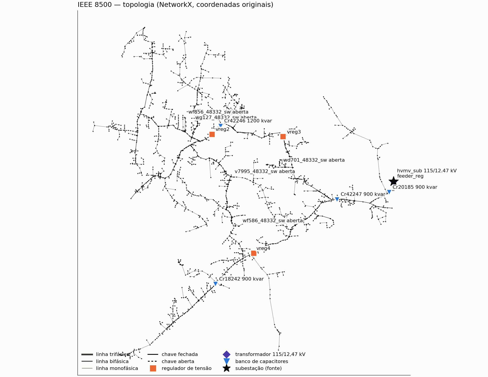
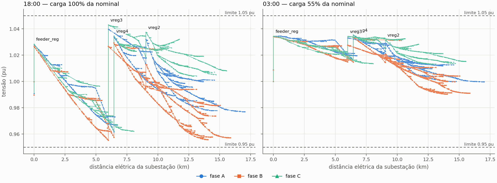
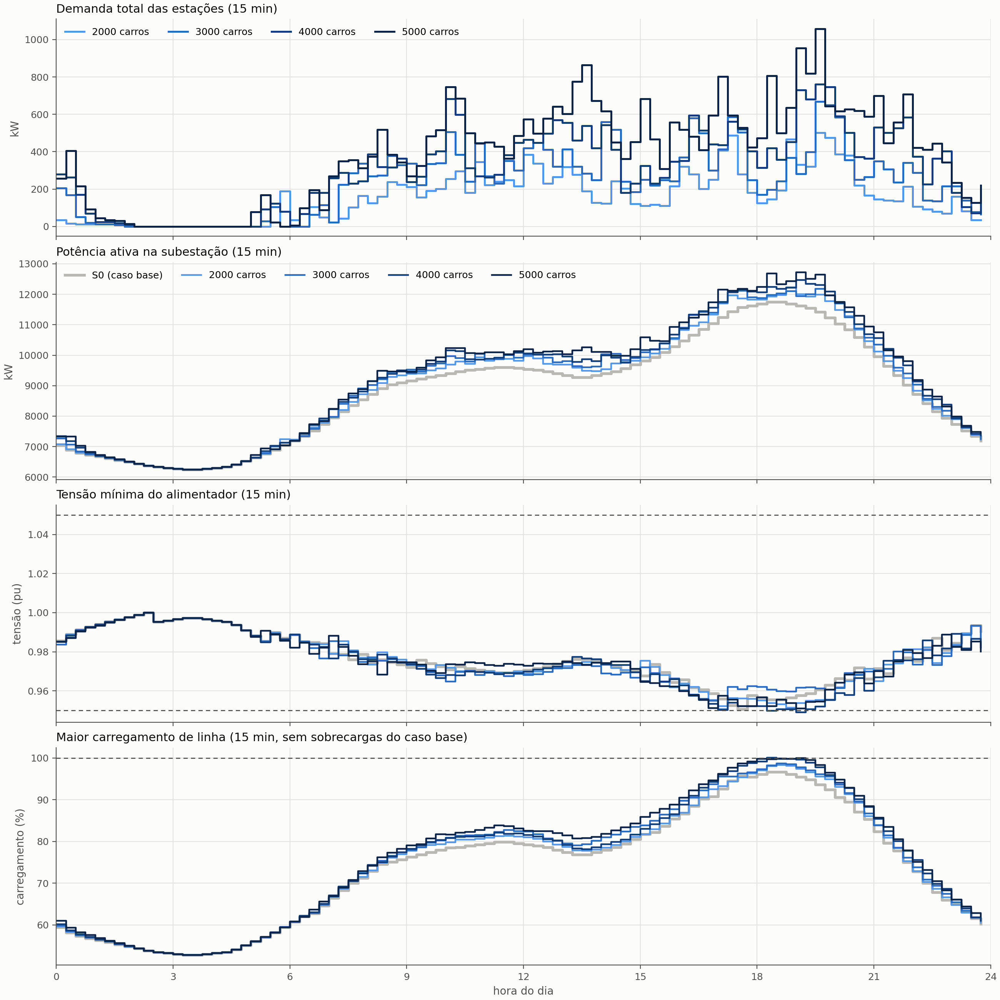
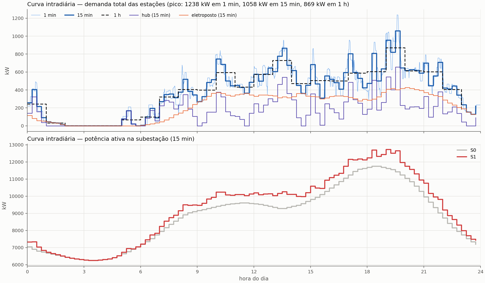
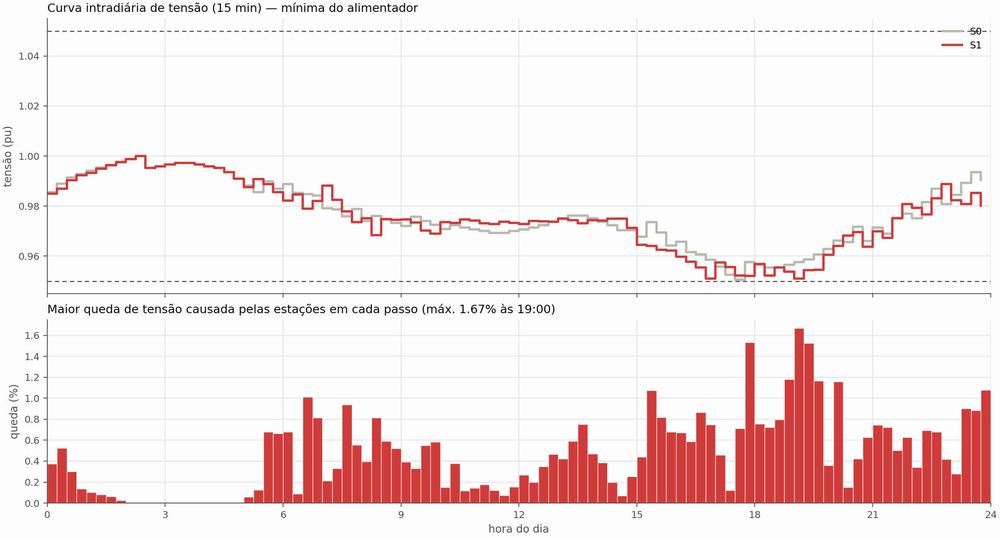
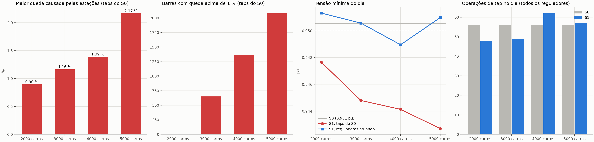
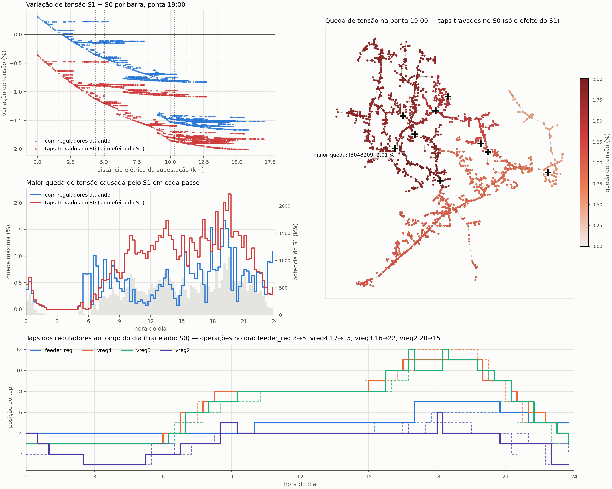
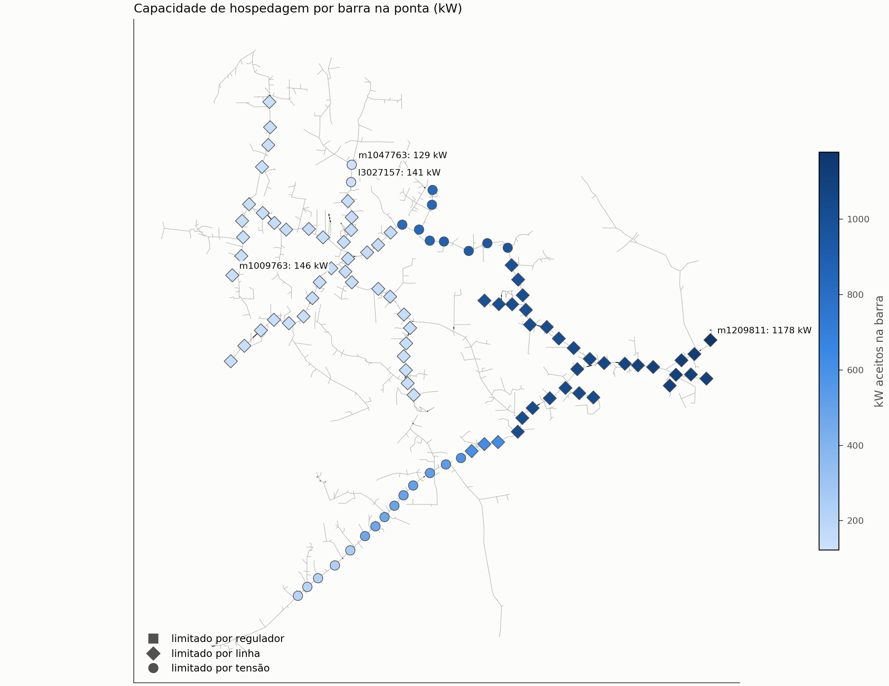
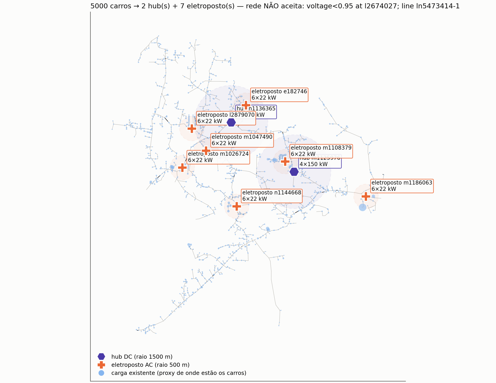

# Módulo EVCS — eletropostos e hubs de recarga

Responsável: **Ayrton** · branch `feature/evcs-ayrton` · configuração `configs/evcs.yaml` · notebook `notebooks/01_evcs_ayrton.ipynb`

Este módulo modela a recarga pública de veículos elétricos no alimentador **IEEE 8500** (redução de média tensão: ~11 × 12 km, 170 km de linhas, 2.521 barras, 10,8 MW na ponta). Ele faz três coisas:

1. Simula **sessões de recarga** minuto a minuto: cada carro tem uma bateria, chega com um SOC, espera na fila se preciso e carrega até uma meta.
2. **Dimensiona e aloca** dois tipos de estação, eletropostos AC e hubs DC, respeitando a capacidade da rede.
3. Calcula as **curvas diárias e intradiárias (15 min)** de demanda e o impacto na rede, comparando com o **caso base S0** (sem estações).

> ⚠️ **Dois ajustes em relação aos dados IEEE 8500** (detalhes em [`data/ieee8500/README.md`](../../data/ieee8500/README.md), seção *Ajustes do estudo*):
> 1. **Ampacidade das linhas** pela bitola do condutor (397 ACSR 587 A … #4 ACSR 140 A), no lugar de 400 A fixos.
> 2. **Nível de tensão:** fonte em 1,00 pu e todos os reguladores com alvo de 1,03 pu, no lugar de 1,05 / 1,054 / 1,042 pu.
>
> Com eles o caso base S0 fica dentro de 0,95–1,05 pu e sem sobrecargas relevantes.

> Todos os valores de `planning:` no `evcs.yaml` são **hipóteses** até termos dados de Honduras. O algoritmo de otimização da alocação **ainda não foi definido**: a escolha de locais atual é uma triagem simples, que serve de referência para comparar com ele.

> A integração S0–S4 com BESS e V2G (Kenia e Cesar) também roda no IEEE 8500. A estação da integração (`station.bus`), a BESS e o V2G ficam na barra `m1125976`, local do hub DC que a triagem escolhe para 2000 carros.

## Arquivos

| Arquivo | O que faz |
|---|---|
| `planning.py` | Frota, tipos de estação, sessões, fila, dimensionamento e escolha de locais por cobertura. Não depende da rede. |
| `strategies.py` | Estratégias de demanda para a integração S0–S4 (`fixed`, `template`). |
| `runner.py` | `python -m evcs` (execução independente) e `run_integrated` (contrato com o coordenador). |
| `model.py`, `candidates.py` | Perfil de demanda limitado pela estação; barras candidatas por fase. |
| `optimization.py` | Lugar reservado para a otimização (ainda `NotImplementedError`). |

Estudos que usam o módulo, em `src/integration/`:

- `evcs_screening.py`: capacidade da rede por barra × frota × cobertura.
- `s1_study.py`: S1 intradiário com as estações escolhidas.

## Como uma sessão de recarga é calculada

Para cada tipo de estação, sorteiam-se sessões até somar a energia pública diária daquele tipo:

```
energia pública/dia = carros × km/dia × kWh/km × parcela pública
energia do tipo     = energia pública × share do tipo           (AC 60 %, DC 40 %)
```

Cada sessão:

| Grandeza | Como sai |
|---|---|
| Bateria | Normal(`battery_kwh`, `battery_std_kwh`), mínimo 10 kWh |
| SOC de chegada | Normal(`arrival_soc_mean`, `arrival_soc_std`), entre 5 % e a meta − 5 % |
| Energia | bateria × (`target_soc` − SOC de chegada) |
| Potência de recarga | mín(potência do carregador, limite do carro): `max_ac_kw` no AC, `max_dc_kw` no DC |
| **Tempo de recarga** | **energia ÷ potência** (arredondado para cima, em minutos) |
| Potência na rede | potência de recarga ÷ `charger_efficiency` |
| Hora de chegada | sorteada com os 24 pesos de `arrival_shape` do tipo, minuto uniforme dentro da hora |

**Fila:** as sessões são distribuídas entre as estações do mesmo tipo. Se todos os carregadores estiverem ocupados, o carro espera. Se a espera passar de `max_wait_min`, ele desiste e a energia conta como **não atendida**. O dia é periódico: uma recarga que passa da meia-noite continua no início do dia.

**Dimensionamento:** os carregadores de cada tipo são o percentil `sizing_quantile` (95 %) do número de carros carregando ao mesmo tempo, sem limite de carregadores. O número de estações é esse total dividido por `chargers_per_site`, arredondado para cima.

**Escolha de locais (triagem):**

0. Candidatas: barras trifásicas na tensão do alimentador. No IEEE 8500 (647 barras trifásicas) elas são reduzidas a pontos a pelo menos `candidate_spacing_m` (250 m → 101 candidatas), preferindo os com mais carga por perto, para que a varredura de capacidade caiba em ~1,5 h.
1. Primeiro os **hubs**, que exigem mais capacidade da rede; depois os **eletropostos**, nas barras restantes.
2. Para cada tipo, escolhe-se a barra que cobre mais demanda ainda descoberta dentro de `coverage_radius_m`.
3. A barra só entra se aceitar a potência instalada da estação (capacidade da rede) e se estiver a pelo menos `min_spacing_m` das outras do mesmo tipo.

A carga existente em cada barra é usada como indicador de onde os carros estão.

## Parâmetros (`configs/evcs.yaml` → `planning:`)

| Parâmetro | Valor atual | Significado |
|---|---|---|
| `candidate_spacing_m` | 250 | Distância mínima entre barras candidatas na triagem (0 = todas) |
| `resolution_min` | 15 | Passo do fluxo de potência intradiário (as sessões são simuladas por minuto) |
| `seed` | 42 | Semente: mesma semente → mesmas sessões |
| `charger_efficiency` | 0,95 | Rendimento do carregador |
| `sizing_quantile` | 0,95 | Percentil de simultaneidade usado para dimensionar carregadores |
| `fleet.evs` | 2000 | Quantidade de carros elétricos na área (caso base; sensibilidade de 2000 a 5000) |
| `fleet.battery_kwh` | 60 | **Bateria média** (kWh úteis) |
| `fleet.battery_std_kwh` | 15 | Variação do tamanho das baterias |
| `fleet.daily_km` / `kwh_per_km` | 35 / 0,18 | Uso diário e consumo |
| `fleet.public_share` | 0,30 | Parcela da energia recarregada fora de casa |
| `fleet.arrival_soc_mean` / `_std` | 0,30 / 0,10 | SOC com que o carro chega à estação |
| `fleet.max_ac_kw` | 11 | Carregador de bordo: limita a recarga AC |
| `fleet.max_dc_kw` | 100 | Limite DC do carro: limita a recarga no hub |

| Tipo | Carregadores por estação | `share` | `target_soc` | `max_wait_min` | Raio / espaçamento |
|---|---|---|---|---|---|
| `ac` — **eletroposto** | 6 × 22 kW (132 kW) | 60 % | 90 % | 30 min | 500 m / 400 m |
| `dc` — **hub** | 4 × 150 kW (600 kW) | 40 % | 80 % | 15 min | 1500 m / 800 m |

`arrival_shape`:

- **Eletroposto:** chegadas de manhã (trabalho e compras) e no fim da tarde.
- **Hub:** picos de deslocamento às 8h e às 17h–19h.

## Como rodar

Tudo em Python (pandapower); não precisa de OpenDSS. Na raiz do repositório:

```powershell
$env:PYTHONPATH="src"          # Linux/macOS: export PYTHONPATH=src
python -m integration.s0_study                    # caso base S0 (~2 min)            -> results/ieee8500/s0/
python -m integration.evcs_screening              # triagem (1ª vez ~1,5 h)          -> results/ieee8500/evcs_screening/
python -m integration.s1_study                    # S1, ~6 min por frota             -> results/ieee8500/s1/
python -m integration.s1_study --intraday-only    # só redesenha a figura intradiária
python -m pytest tests/test_planning.py tests/test_evcs.py tests/test_ieee8500.py -q
```

- A **varredura de capacidade** (parte demorada da triagem) fica salva em `hosting_capacity.csv` e é reaproveitada enquanto as candidatas forem as mesmas; `--resweep` força refazer (necessário se a rede mudar).
- O alimentador de todos os estudos (inclusive a integração S0–S4) é escolhido em `configs/network.yaml` (`ieee8500`; `ieee123` ainda funciona). Os dados da rede vêm de `src/network/data/ieee8500.json`, gerado por `scripts/build_ieee8500_data.py` (só precisa rodar se os arquivos-fonte mudarem).
- O notebook `notebooks/01_evcs_ayrton.ipynb` mostra os resultados salvos e tem uma célula para rodar tudo de novo.
- `results/` não vai para o Git. As figuras deste README estão copiadas em `docs/evcs/figures/`.

### Saídas

Sem `--output`, cada estudo grava em `results/<alimentador>/<estudo>/`. Mapa completo em [`results/README.md`](../../results/README.md).

| Pasta / arquivo | Conteúdo |
|---|---|
| `results/ieee8500/s0/` | Caso base: `topology.png`, `voltage_profile.png`, `voltage_map.png`, `daily.png`, tabelas de linhas, barras e inventário |
| `results/ieee8500/evcs_screening/` | `hosting_capacity.csv` e `hosting_map.png` (capacidade por barra), `fleet_scenarios.csv`, `coverage_<n>_evs.png` |
| `results/ieee8500/s1/intraday_sensitivity.png` | **Curvas intradiárias de todas as frotas × S0** (demanda, subestação, tensão, carregamento) |
| `results/ieee8500/s1/impact_sensitivity.png` | **Impacto S1 × S0 por frota**: queda causada pelas estações, barras afetadas, tensão mínima, operações de tap |
| `results/ieee8500/s1/s0_intraday.csv`, `evs_<n>/intraday.csv` | Os mesmos indicadores a cada 15 min, mais os taps dos reguladores |
| `results/ieee8500/s1/evs_<n>/` | Por frota: **`impact_s0_s1.png`** (variação de tensão S1 − S0 com e sem a ação dos reguladores, mapa, taps), `curves_intraday.png` (1 min / 15 min / 1 h), `voltage_intraday.png`, `allocation.png`, `sessions.png`, curvas por estação (`station_power_*.csv`) e `summary.json` |

## Resultados atuais (IEEE 8500 com os ajustes)

Sensibilidade à quantidade de carros: 2000 a 5000.

### Caso base S0

Ponta de 11.750 kW às 18h; tensão entre 0,951 e 1,043 pu no dia. O alimentador já está carregado na ponta: tronco sul em 2/0 ACSR a 96 % e trechos do tronco 397 ACSR a ~92 %.





### Curvas intradiárias (15 min): todas as frotas × S0



- A demanda das estações tem picos curtos (hubs DC) de manhã, perto das 13h e entre 18h e 20h, que é também a ponta do alimentador.
- Na ponta, a subestação passa de 11.750 kW (S0) para até 12.725 kW (5000 carros).
- A tensão mínima já encosta em 0,95 pu no S0 entre 17h e 20h; as estações quase não a mudam porque os reguladores sobem o tap.
- O que aperta é a **linha**: com 4000–5000 carros o trecho mais carregado chega a **100 % entre 18h e 20h**.

Detalhe da frota de 5000 carros (demanda a 1 min, 15 min e 1 h; tensão a cada passo):





### Impacto S1 × S0: o que as estações fazem com a tensão

Os perfis de tensão do S0 e do S1 parecem iguais porque **os reguladores compensam**: quando as estações puxam a tensão para baixo, eles sobem o tap. Para separar os dois efeitos, cada S1 é resolvido duas vezes: com os reguladores atuando e com os **taps travados nos valores do S0** (o efeito das estações sozinhas).



| | 2000 | 3000 | 4000 | 5000 |
|---|---|---|---|---|
| Maior queda causada pelas estações (taps do S0) | 0,90 % | 1,16 % | 1,39 % | **2,17 %** |
| Barras com queda acima de 1 % (taps do S0) | 0 | 652 | 1.360 | **2.080** |
| Tensão mínima sem a ação dos reguladores (S0: 0,951 pu) | 0,948 pu | 0,945 pu | 0,944 pu | **0,943 pu** |
| Tensão mínima com os reguladores atuando | 0,951 pu | 0,951 pu | **0,949 pu** | 0,951 pu |
| Operações de tap no dia (S0: 56) | 48 | 49 | 62 | 57 |
| Perdas no dia, S0 → S1 (15 min) | 14,3 → 14,8 MWh | → 15,0 MWh | → 15,2 MWh | → 15,6 MWh (+9 %) |

- **Sem os reguladores, a partir de 2000 carros a tensão já sairia da faixa** (abaixo de 0,95 pu). São eles que mantêm o alimentador dentro do limite, e com 4000 carros nem isso basta (0,949 pu).
- A queda é maior **longe da subestação e no norte/oeste**, onde ficam a maioria dos eletropostos; perto da subestação a tensão até sobe (+1,1 %), porque o regulador da subestação sobe o tap.
- Bus a bus, a comparação "com reguladores" mistura a **banda morta** dos reguladores (um banco pode parar um tap abaixo do que estava no S0); por isso o efeito das estações é medido com os taps travados, e o caso regulado pela tensão mínima que de fato ocorre.

Detalhe para 5000 carros:



### S1 na integração S0–S4

A integração (`python -m integration.coordinator`, passo de 1 h) usa as mesmas estações para **5000 carros** (bloco `integration:` do `evcs.yaml`): 2 hubs DC + 7 eletropostos, pico de 913 kW às 19h, mais a estação anfitriã do V2G (`station:`, 88 kW). Em relação ao S0: ponta da subestação **11.783 → 12.573 kW** (e passa das 18h para as 19h), perdas **+9 %**, tronco sul 2/0 ACSR **96 → 100,5 %**, tensão mínima com taps travados **0,938 pu**. É o ponto de partida do S2 (BESS) e do S3 (V2G): ver [`docs/escopo_S2_S3.md`](../../docs/escopo_S2_S3.md).

### Tabela por frota

| | 2000 | 3000 | 4000 | 5000 |
|---|---|---|---|---|
| Hubs DC + eletropostos AC | 1 + 4 | 1 + 5 | 1 + 6 | 2 + 7 |
| Carregadores DC / AC | 2 / 20 | 3 / 28 | 4 / 36 | 5 / 40 |
| Sessões/dia | 111 | 166 | 221 | 276 |
| Pico das estações: 1 min / 15 min / 1 h (kW) | 560 / 501 / 407 | 699 / 669 / 500 | 792 / 762 / 730 | 1238 / 1058 / 869 |
| Ponta da subestação S0 → S1, 15 min (kW) | 11.750 → 12.222 | → 12.172 | → 12.462 | → 12.725 |
| Maior queda de tensão causada pelas estações (S1) | 1,5 % | 1,6 % | 1,3 % | 1,7 % |
| Tensão mínima S1 (S0: 0,9505 pu) | 0,951 pu | 0,951 pu | 0,949 pu | 0,951 pu |
| Recargas atendidas | 95 % | 95 % | 92 % | 93 % |
| Cobertura da carga: hubs / eletropostos | 15 % / 18 % | 15 % / 22 % | 15 % / 25 % | 29 % / 27 % |
| Maior carregamento de regulador/transformador (triagem) | 67 % | 68 % | 69 % | 74 % |
| A rede aceita? (triagem: todas as estações no pico, na ponta) | sim | não: linha 2/0 | não: linha 2/0 | não: tensão e linha 397 |

### Capacidade da rede e alocação





- **Capacidade por barra:** mediana de 475 kW (129 a 1.178 kW) nas 101 candidatas. O que limita é o **tronco**, já carregado no caso base: a linha 2/0 ACSR do sul (`ln5835160-1`) em 42 candidatas, o 397 ACSR (`ln5513564-1`) em 30 e a tensão mínima (0,95 pu) em 25. Reguladores e subestação ficam abaixo de 75 %.
- **A rede aceita até ~2000 carros** pela triagem (critério conservador). No S1, ao longo do dia, os picos das estações não coincidem, mas a linha mais carregada chega a 100 % com 4000–5000 carros. Frotas maiores dependem de BESS/V2G aliviarem a ponta ou de reforço do tronco.
- **A cobertura é baixa:** o número de estações sai da energia da frota, e poucos eletropostos com raio de 500 m cobrem só 18–27 % da carga. No IEEE 8500 a cobertura passa a ser uma restrição relevante para a otimização.
- **Recarga em casa** (70 % da energia) ainda não entra na rede; incluí-la piora todos os cenários.

## Limitações e próximos passos

- **Otimização ainda não definida:** é preciso combinar o que o algoritmo decide, o objetivo, as restrições e o método.
- **Um dia representativo só:** a simulação é de um único dia, com uma semente. Para resultados estatísticos, rodar várias sementes (Monte Carlo).
- **Distribuição das sessões:** as sessões são divididas entre as estações ao acaso, não pela distância do carro à estação.
- **Recarga DC simplificada:** a potência é constante até 80 %, sem a redução real perto do fim da recarga.
- **Resolução da integração:** só o estudo S1 do EVCS roda a cada 15 minutos. A integração S0–S4 com BESS e V2G continua horária. Mudar isso envolve os módulos da Kenia e do Cesar e precisa ser combinado com eles.
- **Limite das linhas:** ampacidade por bitola é hipótese de catálogo (ajuste 1); ela define quase toda a capacidade da rede.
- **Candidatas:** a varredura de capacidade usa 101 das 647 barras trifásicas (`candidate_spacing_m`).
